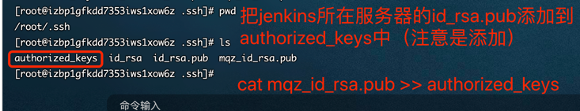
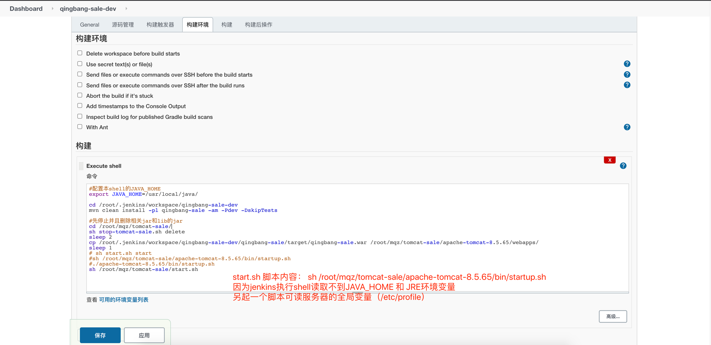

#介绍

#利用Jenkins平台构建maven项目, 并且打包成docker镜像, 上传到阿里云镜像仓库

# docker启动Jenkins
     - 请先预装好docker环境、docker-compose环境
     - 1.使用docker镜像启动： jenkins-docker-compose.yml

            version: "3.7"
            services:
            jenkines-1:
            hostname: jenkines-1
            image: docker.io/jenkins:latest
            container_name: jenkins-container-1
            volumes:
            - /home/mqz/jenkins-docker/:/var/jenkins_home
            - /var/run/docker.sock:/var/run/docker.sock
            #- /usr/bin/docker:/usr/bin/docker
            #- /usr/lib/x86_64-linux-gnu/libltdl.so.7:/usr/lib/x86_64-linux-gnu/libltdl.so.7
            ports:
            - "8080:8080"
            - "50000:50000"
            #    networks:
            #      - nacos_net
                restart: always
                privileged: true
            #networks:
            #  nacos_net:
            #    external: true

    - 2. 构建并且启动docker容器： 具体的docker命令可参考项目  nacos-consumer-a （spring-cloud-alibaba那一块）
        docker-compose -f jenkins-docker-compose.yml up -d 

   
    - 3. 注意：
           #问题： touch: cannot touch ‘/var/jenkins_home/copy_reference_file.log’: Permission denied
           Can not write to /var/jenkins_home/copy_reference_file.log. Wrong volume permissions?
         
                 #原因：jenkins容器的当前用户:是jenkins而且/var/jenkins_home目录是属于jenkins用户拥有的而当映射本地数据卷时，
                       /var/jenkins_home目录的拥有者变成了root用户，所以当jenkins用户的进程访问/var/jenkins_home目录时，会出现 Permission denied
                 
                 #解决命令：sudo chown -R 1000 /home/mqz/jenkins-docker
                 
           #docker 启动的jenkins可能会在install plugins（安装jenkins插件）的时候失败，因为docker对jenkins的版本支持还是之前的旧版导致的。
           * docker对Jenkins版本支持没有更新，导致安装Jenkins插件的时候会有问题
           * 挂载的Jenkins_home目录没权限的问题
           * 建议使用下载war包方式

# war启动Jenkins   

    - 采用下载 jenkins.war的方式：
        * a.下载Jenkins.war包，下载官网：https://www.jenkins.io/zh/download/ 

        * b.执行启动的脚本： nohup java -jar jenkins.war &
        
# 导入外部下载的插件：
     - 1 /jenkins-maven打包插件/maven-plugin.hpi
     
# 配置打包完成后执行的脚本
   - 1.上传文件：建议使用expect 上传
   - 2.重启服务，建议使用jenkins 的 public-over-ssh插件，
      * 安装jenkins的 public-over-ssh插件
      * 编写远程的重启脚本
      * 在jenkins中配置sh /usr/local/start.sh 脚本

# 配置Jenkins的public over ssh

   - 需要配置被登陆服务器的访问，当前jenkins所在服务器的公钥配置到被登陆服务器中
   - ssh-keygen ： 生成私、公钥匙 ，在jenkins所在服务器执行即可
      会提示输入passphrase，这个记住后面使用expect的时候需要使用到（公钥登陆凭证）
   - 配置被登陆服务器的authorized_keys，加入jenkins所在服务器的公钥：
      cat id_rsa.pub >> authorized_keys
     

#配置jenkins项目

# 使用expect登陆远程服务器、执行上传文件
 - yum install -y expect 
 - 参考 expect上传脚本.sh
 - 注意，执行expect的脚本，需要使用 expect：

   
 - expect 语法相关：
   spawn               交互程序开始后面跟命令或者指定程序
   expect              获取匹配信息匹配成功则执行expect后面的程序动作
   send exp_send       用于发送指定的字符串信息
   exp_continue        在expect中多次匹配就需要用到
   send_user           用来打印输出 相当于shell中的echo
   exit                退出expect脚本
   eof                 expect执行结束 退出
   set                 定义变量
   puts                输出变量
   set timeout         设置超时时间

    
# jenkins读取不到环境变量
    - jenkins中构建后 Execute Shell异常：
        Neither the JAVA_HOME nor the JRE_HOME environment variable is defined At least one of these environment variable is needed to run this program
    - 网上说在tomcat的bin下的 setclasspath.sh 和 catalina.sh均加上jdk和jre环境变量：
        set JAVA_HOME=/usr/local/java
        set JRE_HOME=/usr/local/java/jre
      亲测无效
    - 解决办法：
        另写一个脚本脚本内容为执行tomcat启动脚本，该新建的脚本可以读取到全局变量

