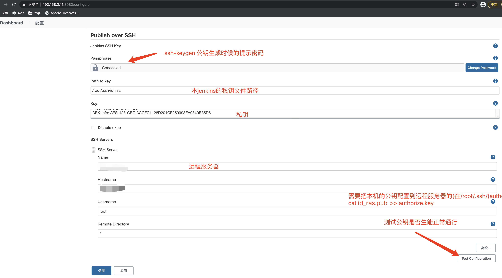
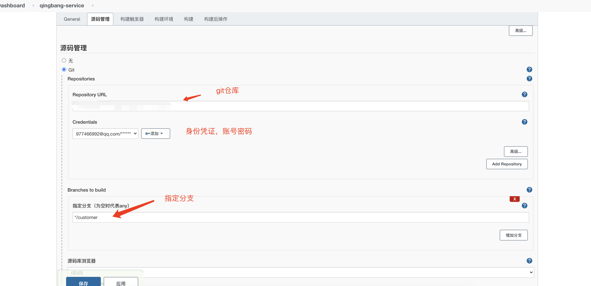

#介绍

#利用Jenkins平台构建maven项目, 并且打包成docker镜像, 上传到阿里云镜像仓库

# 安装Jenkins
    - 1.使用docker安装：
        * docker对Jenkins版本支持没有更新，导致安装Jenkins插件的时候会有问题
        * 挂载的Jenkins_home目录没权限的问题
        
    - 2.采用下载 jenkins.war的方式：
        * a.下载Jenkins.war包
        * b.执行启动的脚本： nohup java -jar jenkins.war
        
# 导入外部下载的插件：
     - 1 /jenkins-maven打包插件/maven-plugin.hpi
     
# 配置打包完成后执行的脚本

# 配置Jenkins的public over ssh

#配置jenkins项目

# 使用expect登陆远程服务器、执行上传文件
 - yum install -y expect 
 - 参考 expect上传脚本.sh
 - 注意，执行expect的脚本，需要使用 expect：

   
 - expect 语法相关：
   spawn               交互程序开始后面跟命令或者指定程序
   expect              获取匹配信息匹配成功则执行expect后面的程序动作
   send exp_send       用于发送指定的字符串信息
   exp_continue        在expect中多次匹配就需要用到
   send_user           用来打印输出 相当于shell中的echo
   exit                退出expect脚本
   eof                 expect执行结束 退出
   set                 定义变量
   puts                输出变量
   set timeout         设置超时时间

    

 
 

    
