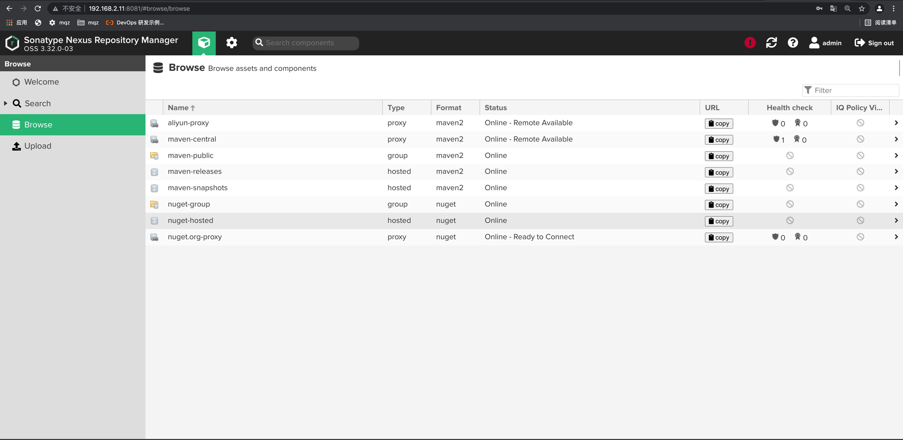

#Nexus 本地私库


- 1：  docker部署：参考 ./docker/docker-nexus.yml
- 2：  tar部署：   下载链接 https://help.sonatype.com/repomanager3/download （速度慢）

- 3： docker部署admin的密码： 容器内 /nexus-data/admin.password
- 4： 用admin/密码登陆nexus：

    
    ````  
        默认仓库说明：
        maven-central：maven 中央库，默认从 https://repo1.maven.org/maven2/ 拉取 jar
        maven-releases：私库发行版 jar，初次安装请将 Deployment policy 设置为 Allow redeploy
        maven-snapshots：私库快照（调试版本）jar
        maven-public：仓库分组，把上面三个仓库组合在一起对外提供服务，在本地 maven 基础配置 settings.xml 或项目 pom.xml 中使用
  
    ````
        仓库类型说明：
        group：这是一个仓库聚合的概念，用户仓库地址选择 Group 的地址，即可访问 Group 中配置的，用于方便开发人员自己设定的仓库。maven-public 就是一个 Group 类型的仓库，内部设置了多个仓库，访问顺序取决于配置顺序，3.x 默认为 Releases、Snapshots、Central，当然你也可以自己设置。
        hosted：私有仓库，内部项目的发布仓库，专门用来存储我们自己生成的 jar 文件
        snapshots：本地项目的快照仓库
        releases： 本地项目发布的正式版本
        proxy：代理类型，从远程中央仓库中寻找数据的仓库（可以点击对应的仓库的 Configuration 页签下 Remote Storage 属性的值即被代理的远程仓库的路径），如可配置阿里云 maven 仓库
        central：中央仓库
    
  
- 5： 创建一个代理仓库：  http://maven.aliyun.com/nexus/content/groups/public/ ，创建后如下图：

  
- 6： 创建完后修改maven-public的加载成员仓库顺序：

  


#### maven项目中使用nexus私服：
- Maven 配置私服下载有两种方式：
    ````
    setting.xml：maven的配置文件，该文件配置的是全局模式
    pom.xml：项目pom文件，该文件的配置的是项目独享模式

    若 pom.xml 和 setting.xml 同时配置了，以 pom.xml 为准。
  
- 加载顺序： 本地仓库 --> 私服 maven-releases --> 私服 maven-snapshots --> 远程阿里云 maven 仓库 --> 远程中央仓库

- 方式1配置maven的setting.yml文件： 配置后不需要再配置 pom.xml 文件

    ````
      <mirrors>
        <mirror>
            <!--该镜像的唯一标识符。id用来区分不同的mirror元素。 -->
            <id>maven-public</id>
            <!--镜像名称 -->
            <name>maven-public</name>
            <!--*指的是访问任何仓库都使用我们的私服-->
            <mirrorOf>*</mirrorOf>
            <!--该镜像的URL。构建系统会优先考虑使用该URL，而非使用默认的服务器URL。 -->
            <url>http://192.168.2.11:8081/repository/maven-public/</url>     
        </mirror>
    </mirrors>
  ````

  若没有搭建私服，则可以使用阿里云的仓库：

  ````
    <mirror>
    <id>nexus-aliyun</id>
    <name>Nexus aliyun</name>
    <mirrorOf>*</mirrorOf>
    <url>http://maven.aliyun.com/nexus/content/groups/public</url>
    </mirror>
  ````
  

- 方式2配置项目的pom文件： 

  ````
    <!-- 本地私库Nexus地址 -->
    <repositories>
        <repository>
            <id>central</id>
            <name>Maven myself Mirror</name>
            <url>http://192.168.2.11:8081/repository/maven-central/</url>
            <releases>
                <enabled>true</enabled>
            </releases>
            <snapshots>
                <enabled>false</enabled>
            </snapshots>
        </repository>

        <repository>
            <id>pubilc</id>
            <name>Maven myself Mirror</name>
            <url>http://192.168.2.11:8081/repository/maven-public/</url>
            <releases>
                <enabled>true</enabled>
            </releases>
            <snapshots>
                <enabled>false</enabled>
            </snapshots>
        </repository>

    </repositories>
  ````

  若没有搭建私服，则可以使用阿里云的仓库：

  ````
    <repositories>
     <repository>
        <id>maven-aliyun</id>
        <url>http://maven.aliyun.com/nexus/content/groups/public/</url>
        <releases>
           <enabled>true</enabled>
        </releases>
        <snapshots>
           <enabled>true</enabled>
           <updatePolicy>always</updatePolicy>
           <checksumPolicy>fail</checksumPolicy>
        </snapshots>
     </repository>
    </repositories>
  ````
  


- 把本地项目发布到Nexus私库中，（类似本地项目打包，生成jar包并安到本地仓库）

  1. 修改maven的setting文件： 在servers节点添加如下配置
  
    ````
      <!--nexus更新依赖 -->
      <server>
          <id>releases</id>
          <username>admin</username>
          <password>mengqizhang</password>
      </server>
      <server>
          <id>snapshots</id>
          <username>admin</username>
          <password>mengqizhang</password>
      </server>
    ````
  
  2. 修改项目的pom文件： 
        
  ````
      <distributionManagement>
            <repository>
                <id>releases</id>
                <name>Releases</name>
                <url>http://192.168.2.11:8081/repository/maven-releases/</url>
            </repository>
            <snapshotRepository>
                <id>snapshots</id>
                <name>Snapshot</name>
                <url>http://192.168.2.11:8081/repository/maven-snapshots/</url>
            </snapshotRepository>
    </distributionManagement>
  ````
  
  3. 执行 mvn clean deploy :


  
  